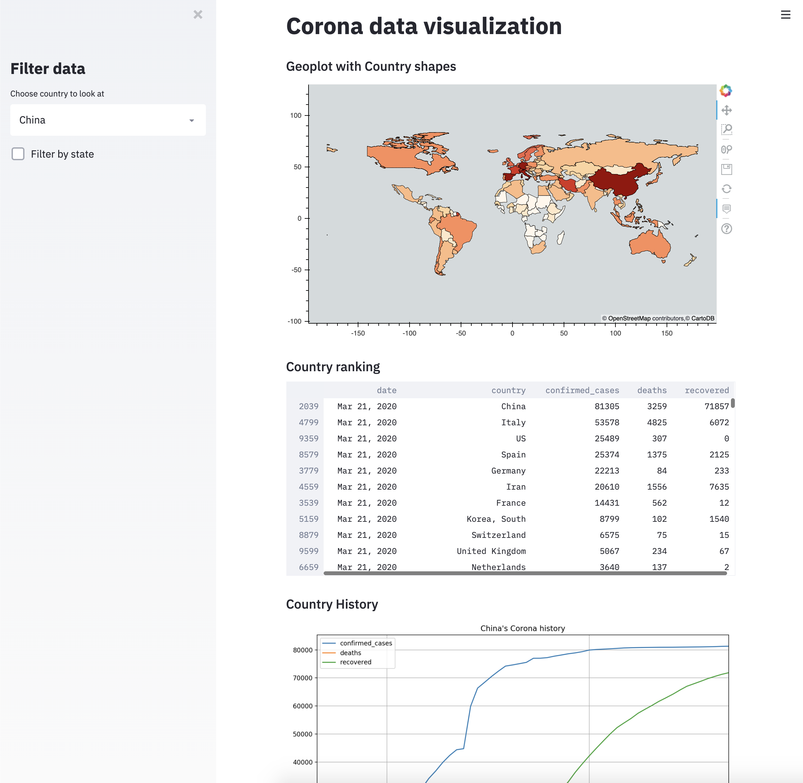

# COVID-19 Dashboard
A Python-based Dashboard showing COVID-19 data using the library streamlit.



## Data source
The data used in this Dashboard comes from https://github.com/CSSEGISandData/COVID-19.

## Usage
In order to create the prepared dataset used for the visualization run:
```bash
python data_preparation.py
```
As of now the folder where the COVID data is located needs to be specified in the mentioned python file. After the prepared data is created you can start the streamlit app using:
```bash
streamlit run dashboard.py
```